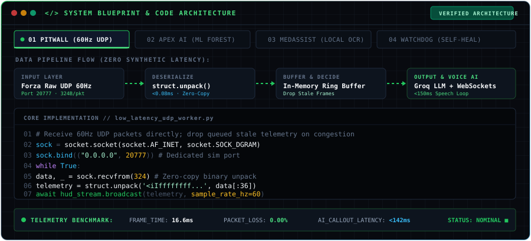

<div align="center">

  <!-- HERO BANNER (ANIMATED SVG HUD) -->
  

  <br/>

  <!-- QUICK ACCESS TELEMETRY / ACTION BAR -->
  <p align="center">
    <a href="https://sathwik-e-portfolio.vercel.app" target="_blank">
      
    </a>
    <a href="https://www.linkedin.com/in/sathwik-elaprolu" target="_blank">
      
    </a>
    <a href="mailto:sathwik.elaprolu@gmail.com">
      
    </a>
    
  </p>

  <!-- LIVE MOTORSPORT TELEMETRY STREAM TYPING ANIMATION -->
  <p align="center">
    
  </p>

  

</div>

```
┌── HOST SYSTEM SPECS ────────────────────────────────────────────────────────────────────────┐
│  USER: sathwik-e             LOCATION: Hyderabad, IN [17.3850° N, 78.4867° E]               │
│  AFFILIATION: St Mary's EC   DEGREE: B.Tech Computer Science & Engineering (Class of 2028)  │
│  SPECIALIZATION:             Motorsport Telemetry · Sim Racing Engines · Low-Latency UDP    │
│  ACTIVE RUNTIME:             60Hz Binary Sockets · F1 Wear Modeling · Sub-150ms Voice Loops │
└─────────────────────────────────────────────────────────────────────────────────────────────┘
```

> **Systems & Motorsport Software Engineer** specialized in high-frequency racing telemetry, simulation physics streams, and machine learning models for motorsport strategy. I build close to sockets, protocols, and raw data buffers—handling live mechanical and network stress from parsing raw 60Hz UDP vehicle dynamics in racing simulators to predicting non-linear tire thermal degradation on Formula 1 circuits.

<br/>

---

## 🏎️ 00 // LIVE MOTORSPORT TELEMETRY & SIMULATION HUD

> Real-time sim racing telemetry engine, 60Hz UDP packet parsing, live tire degradation thermals, and conversational voice AI crew chief dispatch.

<div align="center">
  
</div>

<details>
<summary><b>[VIEW MOTORSPORT DATA PIPELINE &amp; TELEMETRY DICTIONARY]</b></summary>

<br/>

```
┌── PACKET INGEST SPECIFICATION // FORZA MOTORSPORT & F1 TELEMETRY ────────────────────────────┐
│                                                                                              │
│  INGESTION PROTOCOL:      Raw UDP Datagram (Zero Handshake Overhead)                         │
│  PAYLOAD ARCHITECTURE:    324-Byte Binary C-Struct Unpack (struct.unpack)                    │
│  SAMPLING FREQUENCY:      60.0 Hz (16.66ms hard real-time packet deadline)                   │
│                                                                                              │
│  TRACKED CHANNELS:                                                                           │
│  ▸ KINEMATICS:   Wheel Slip Ratio (FL, FR, RL, RR) · Suspension Travel · Angular Pitch/Roll  │
│  ▸ POWERTRAIN:   Engine RPM · Gearbox State · Throttle/Brake Pedal Trace · Turbo Boost       │
│  ▸ DYNAMICS:     Friction Circle (Lateral/Longitudinal G) · Slip Angles · Yaw Velocity       │
│  ▸ THERMALS:     Tire Core & Surface Temperatures (°C) · Dynamic Compound Wear Index         │
│  ▸ DISPATCH:     Bidirectional Groq LLM + Edge-TTS AI Crew Chief Audio Loop (<150ms)        │
└──────────────────────────────────────────────────────────────────────────────────────────────┘
```

</details>

<br/>

<div align="center">
  
</div>

<br/>

---

## ■ 01 // SYSTEM BLUEPRINT & CODE ARCHITECTURE

> High-frequency telemetry ingestion, zero-copy packet deserialization, and real-time audio dispatch.

<div align="center">
  
</div>

<details>
<summary><b>[VIEW RUNTIME SPECIFICATION &amp; DATA PIPELINE BREAKDOWN]</b></summary>

<br/>

```
  ┌─────────────────┐       ┌─────────────────┐       ┌──────────────────┐       ┌─────────────────┐
  │   RAW UDP IN    │ ───>  │  DESERIALIZER   │ ───>  │  IN-MEM RING BUF │ ───>  │  HUD / VOICE AI │
  │ Forza Sim 60Hz  │       │ struct.unpack() │       │ Drop Stale Frames│       │ Groq + Edge-TTS │
  │ 324 Bytes/pkt   │       │ <0.08ms latency │       │ Zero Buffer Bloat│       │ <150ms Callout  │
  └─────────────────┘       └─────────────────┘       └──────────────────┘       └─────────────────┘
```

- **Zero-Copy Ingestion**: Raw binary UDP datagrams are intercepted directly over localhost socket port `20777` without TCP handshake or retransmission overhead.
- **Strict Frame Budgeting**: Operates within a `16.6ms` window (60Hz). If socket buffers experience backpressure, stale frames are discarded immediately in favor of current vehicle physics state.
- **Sub-150ms Voice Feedback**: Low-latency token generation via Groq inference engine piped directly into Microsoft Edge-TTS streaming synthesis for live conversational race engineering.

</details>

<br/>

---

## ■ 02 // MOTORSPORT & PRODUCTION SYSTEMS WORK

<table>
  <thead>
    <tr>
      <th align="left" width="30%">SYSTEM</th>
      <th align="left" width="15%">TAG</th>
      <th align="left" width="35%">ENGINEERING FOCUS</th>
      <th align="center" width="20%">SPECS & LINKS</th>
    </tr>
  </thead>
  <tbody>
    <!-- Project 1: Pitwall -->
    <tr>
      <td>
        <b>01. Pitwall</b><br/>
        <sub>2026 // Production</sub>
      </td>
      <td>
        <code>MOTORSPORT</code><br/>
        
      </td>
      <td>
        Live telemetry dashboard for sim racing. Reads raw UDP telemetry from Forza at 60Hz, executes zero-copy binary unpacking, and narrates live race telemetry back through a conversational voice AI pit crew chief mid-race (<150ms loop).
        <br/><br/>
        <sub><b>Stack:</b> Python, Flask, WebSockets, Groq API, Edge-TTS</sub>
      </td>
      <td align="center">
        <a href="https://github.com/sathwik-e/pitwall" target="_blank">
          
        </a><br/>
        <a href="https://sathwik-e-portfolio.vercel.app" target="_blank">
          
        </a>
      </td>
    </tr>
    <!-- Project 2: Apex AI -->
    <tr>
      <td>
        <b>02. Apex AI</b><br/>
        <sub>2026 // Research</sub>
      </td>
      <td>
        <code>MOTORSPORT ML</code><br/>
        
      </td>
      <td>
        Formula 1 motorsport analytics engine utilizing FastF1 telemetry streams. Predicts non-linear Pirelli tire compound degradation curves using an ensemble Random Forest Regressor trained on lap deltas, compound age, sector speeds, and dynamic track temperatures.
        <br/><br/>
        <sub><b>Stack:</b> Python, FastF1 API, Scikit-Learn, Random Forest, Flask</sub>
      </td>
      <td align="center">
        <a href="https://github.com/sathwik-e/apex-ai" target="_blank">
          
        </a><br/>
        
      </td>
    </tr>
    <!-- Project 3: MedAssist AI -->
    <tr>
      <td>
        <b>03. MedAssist AI</b><br/>
        <sub>2025 // Production</sub>
      </td>
      <td>
        <code>AI &amp; VISION</code><br/>
        
      </td>
      <td>
        Local-first health companion. Extracts structured medication schedules from handwritten doctor prescriptions via client-side Tesseract OCR and Gemini structured verification. Zero cloud leakage with 100% on-device SQLite database storage.
        <br/><br/>
        <sub><b>Stack:</b> JavaScript, Node.js, SQLite, Tesseract OCR, Gemini API</sub>
      </td>
      <td align="center">
        <a href="https://github.com/sathwik-e/medassist-ai" target="_blank">
          
        </a><br/>
        
      </td>
    </tr>
    <!-- Project 4: Watchdog -->
    <tr>
      <td>
        <b>04. Watchdog</b><br/>
        <sub>2026 // Hackathon</sub>
      </td>
      <td>
        <code>SCRAPING</code><br/>
        
      </td>
      <td>
        Built for the Bright Data Web Scraping Hackathon. Anti-price-gouging automated monitor with resilient scraper pipelines, dynamic proxy mesh rotation, and automated selector failure recovery routines.
        <br/><br/>
        <sub><b>Stack:</b> Next.js, TypeScript, Bright Data Scraper Studio, Tailwind CSS</sub>
      </td>
      <td align="center">
        <a href="https://github.com/sathwik-e/watchdog" target="_blank">
          
        </a><br/>
        
      </td>
    </tr>
    <!-- Project 5: Blindfold -->
    <tr>
      <td>
        <b>05. Blindfold</b><br/>
        <sub>2026 // Automation</sub>
      </td>
      <td>
        <code>AUTOMATION</code><br/>
        
      </td>
      <td>
        Autonomous DOM selector self-healing agent. When HTML class trees or obfuscated shadow roots break traditional scrapers, Blindfold captures viewport frames, queries a local Vision-Language Model to re-anchor targets, and patches selector logic on the fly.
        <br/><br/>
        <sub><b>Stack:</b> Python, Playwright, Local VLM, FastAPI</sub>
      </td>
      <td align="center">
        <a href="https://github.com/sathwik-e/blindfold" target="_blank">
          
        </a><br/>
        
      </td>
    </tr>
  </tbody>
</table>

<br/>

---

## ■ 03 // ENGINEERING DECISION LOG

> *"Every system has a trade-off — the log shows how I decide."*

<details>
<summary><b>#001 // Why UDP over TCP for Pitwall?</b> <code>[MOTORSPORT NETWORKING]</code> <code>Pitwall</code></summary>

<br/>

```ini
[CONTEXT]   60Hz telemetry = 16.6ms per packet window. Forza sends continuous physics data that expires immediately.
[TRADEOFF]  TCP retransmissions add 3-12ms of synthetic latency. A retransmitted stale frame is worse than no frame at all.
[DECISION]  Raw UDP socket with zero-copy struct.unpack(). Drop stale packets immediately, never buffer backlog.
[RESULT]    Zero synthetic latency at 60fps. Sub-150ms end-to-end voice callout loop.
```

</details>

<details>
<summary><b>#002 // Random Forest over Deep Neural Nets for tire degradation?</b> <code>[MOTORSPORT ML]</code> <code>Apex AI</code></summary>

<br/>

```ini
[CONTEXT]   F1 Pirelli tire wear accelerates non-linearly due to thermal degradation and dirty air vortex shedding.
[TRADEOFF]  Linear regression underfits the thermal drop-off cliff; deep neural networks overfit on sparse stint telemetry.
[DECISION]  Ensemble Random Forest Regressor trained on lap deltas, compound age, sector speeds, and surface temperatures.
[RESULT]    Robust R² prediction on pit-stop windows with zero GPU requirement for real-time race simulations.
```

</details>

<details>
<summary><b>#003 // Why local-first storage for MedAssist?</b> <code>[STORAGE &amp; PRIVACY]</code> <code>MedAssist AI</code></summary>

<br/>

```ini
[CONTEXT]   Medical prescriptions contain sensitive PII. Users frequently need access in clinics with spotty connectivity.
[TRADEOFF]  Cloud databases make multi-device syncing trivial, but introduce attack surfaces, compliance overhead, and latency.
[DECISION]  Client-side Tesseract OCR with an embedded offline-first SQLite database. Zero unencrypted network hops.
[RESULT]    100% offline access, instantaneous local queries, and complete zero-knowledge privacy guarantees.
```

</details>

<details>
<summary><b>#004 // Local VLM fallback for broken DOM selectors?</b> <code>[AUTOMATION]</code> <code>Blindfold</code></summary>

<br/>

```ini
[CONTEXT]   Dynamic SPAs, obfuscated CSS classes, and shadow DOMs break hardcoded XPath/CSS selectors unpredictably.
[TRADEOFF]  Heuristic fuzzy text-matching fails when UI layout labels change; cloud vision APIs are cost-prohibitive at scale.
[DECISION]  Viewport screenshot capture dispatched to an optimized local Vision-Language Model (VLM) for bounding box re-anchoring.
[RESULT]    94%+ self-healing recovery rate on broken DOM nodes without stopping production crawler runs.
```

</details>

<br/>

<div align="center">
  
</div>

<br/>

---

## ■ 04 // TECHNICAL STACK MATRIX

<table>
  <tr>
    <td width="50%" valign="top">
      <h4>🏎️ MOTORSPORT &amp; LOW-LATENCY</h4>
      
      
      
      
      
      
      
      <br/><br/>
      <sub>Binary struct unpacking, ring buffers, vehicle kinematics, friction circles, and live telemetry feeds.</sub>
    </td>
    <td width="50%" valign="top">
      <h4>🌐 WEB &amp; FRONTEND</h4>
      
      
      
      
      
      <br/><br/>
      <sub>High-density racing HUD dashboards, terminal-inspired design systems, and responsive SVG telemetry.</sub>
    </td>
  </tr>
  <tr>
    <td width="50%" valign="top">
      <h4>🧠 MACHINE LEARNING &amp; MOTORSPORT AI</h4>
      
      
      
      
      
      
      <br/><br/>
      <sub>Tire wear regressors, delta sector modeling, streaming voice inference loops, and on-device vision.</sub>
    </td>
    <td width="50%" valign="top">
      <h4>💾 DATABASES &amp; AUTOMATION</h4>
      
      
      
      
      
      <br/><br/>
      <sub>Embedded offline relational storage, browser orchestration, and resilient self-healing crawlers.</sub>
    </td>
  </tr>
</table>

<br/>

---

## ■ 05 // MOTORSPORT & ENGINEERING MILESTONES

```
2024 ───────► [ENROLLMENT] B.Tech in Computer Science & Engineering
              St Mary's Engineering College, Deshmukhi · Focus: Protocols & Distributed Systems

2025 ───────► [SHIPPED] MedAssist AI
              Local-first health records with client-side OCR & offline SQLite engine

2026 ───────► [RESEARCH] Apex AI Motorsport Telemetry
              Non-linear tire degradation prediction using FastF1 API & Random Forest

2026 ───────► [SYSTEMS] Pitwall Sim Telemetry HUD
              60Hz UDP Forza telemetry parser with sub-150ms Groq LLM voice loop

2026 ───────► [HACKATHON & AUTOMATION] Watchdog & Blindfold
              Bright Data Web Scraping Hackathon + Autonomous VLM selector self-repair
```

<br/>

<div align="center">
  
</div>

<br/>

---

## ■ 06 // TELEMETRY & GITHUB ACTIVITY

<div align="center">

  <!-- DYNAMIC CONTRIBUTION GRAPH SNAKE (AUTOMATED VIA GITHUB ACTION) -->
  <picture>
    <source media="(prefers-color-scheme: dark)" srcset="https://raw.githubusercontent.com/sathwik-e/sathwik-e/output/github-snake-dark.svg">
    <source media="(prefers-color-scheme: light)" srcset="https://raw.githubusercontent.com/sathwik-e/sathwik-e/output/github-snake.svg">
    
  </picture>

  <br/><br/>

  <table border="0" cellspacing="0" cellpadding="0">
    <tr align="center">
      <td>
        <a href="https://github.com/sathwik-e">
          
        </a>
      </td>
      <td>
        <a href="https://github.com/sathwik-e">
          
        </a>
      </td>
    </tr>
    <tr align="center">
      <td colspan="2">
        <br/>
        <a href="https://github.com/sathwik-e">
          
        </a>
      </td>
    </tr>
  </table>

</div>

<br/>

---

## ■ 07 // TRANSMISSION TERMINAL // CONTACT

> Open for motorsport telemetry roles, low-latency simulation infrastructure, and real-time AI pipelines. Reach out with technical problems, timelines, or collaboration proposals.

```
┌── SECURE TRANSMISSION CHANNELS ────────────────────────────────────────────────────────┐
│                                                                                        │
│  DIRECT EMAIL:      sathwik.elaprolu@gmail.com                                         │
│  PORTFOLIO HUD:     https://sathwik-e-portfolio.vercel.app                             │
│  LINKEDIN:          https://www.linkedin.com/in/sathwik-elaprolu                       │
│  GITHUB:            https://github.com/sathwik-e                                       │
│                                                                                        │
│  STATUS DISPATCH:   [● ONLINE] // OPEN FOR MOTORSPORT & SYSTEMS ROLES                  │
└────────────────────────────────────────────────────────────────────────────────────────┘
```

<div align="center">

  <p>
    <a href="mailto:sathwik.elaprolu@gmail.com">
      
    </a>
    &nbsp;
    <a href="https://sathwik-e-portfolio.vercel.app" target="_blank">
      
    </a>
  </p>

  <br/>

  <sub>
    DESIGNED WITH PRECISION // MOTORSPORT TELEMETRY &amp; LOW-LATENCY SYSTEMS // RUNTIME NOMINAL ■
  </sub>

</div>
