  <!-- 01 // UNIFIED MASTER ARCHITECTURE BANNER (WITH CONTINUOUS GERSTNER OCEAN WAVE GRID) -->
  

    

  <!-- ACTION PILLS & DIRECT CONNECTORS -->
  

    
    &nbsp;
    
    &nbsp;
    
  

  <!-- LIVE TELEMETRY STREAM -->
  

    
  

 

### 01 // PRODUCTION SYSTEMS &amp; ARCHITECTURE

<table>
  <tr>
    <td width="50%" align="center">
      
      

        <a href="https://sathwik-e-portfolio.vercel.app" target="_blank"><b>Live Demo ↗</b></a> &nbsp;|&nbsp; <a href="https://github.com/sathwik-e/pitwall" target="_blank"><b>Source Code →</b></a>
      

    </td>
    <td width="50%" align="center">
      
      

        <a href="https://sathwik-e-portfolio.vercel.app" target="_blank"><b>Live Demo ↗</b></a> &nbsp;|&nbsp; <a href="https://github.com/sathwik-e/apex-ai" target="_blank"><b>Source Code →</b></a>
      

    </td>
  </tr>
  <tr>
    <td width="50%" align="center">
      
      

        <a href="https://sathwik-e-portfolio.vercel.app" target="_blank"><b>Live Demo ↗</b></a> &nbsp;|&nbsp; <a href="https://github.com/sathwik-e/MedAssist-AI" target="_blank"><b>Source Code →</b></a>
      

    </td>
    <td width="50%" align="center">
      
      

        <a href="https://sathwik-e-portfolio.vercel.app" target="_blank"><b>Live Demo ↗</b></a> &nbsp;|&nbsp; <a href="https://github.com/sathwik-e/brightdata-watchdog" target="_blank"><b>Source Code →</b></a>
      

    </td>
  </tr>
</table>

  
<b>📊 Pitwall Telemetry HUD Architecture View ▾</b>

  

    
  

 

### 02 // GITHUB ACTIVITY &amp; TELEMETRY

  <!-- DYNAMIC CONTRIBUTION GRAPH SNAKE -->
  <picture>
    <source media="(prefers-color-scheme: dark)" srcset="https://raw.githubusercontent.com/sathwik-e/sathwik-e/output/github-snake-dark.svg">
    <source media="(prefers-color-scheme: light)" srcset="https://raw.githubusercontent.com/sathwik-e/sathwik-e/output/github-snake.svg">
    
  </picture>

  

    
    &nbsp;
    
  

   

  
    Sathwik Elaprolu · Systems &amp; AI Engineer · Hyderabad, India ■
  

