  <!-- 01 // HERO ARCHITECTURE BANNER (WITH STRAIGHT GRID & WAVE ANIMATION) -->
  

    

  <!-- 02 // PRIMARY SPOTLIGHT: LIVE PORTFOLIO HUD -->
  

    

  <!-- ACTION PILLS & DIRECT CONNECTORS -->
  

    
    &nbsp;
    
    &nbsp;
    
  

  <!-- LIVE TELEMETRY STREAM -->
  

    
  

 

### 01 // PRODUCTION SYSTEMS & ARCHITECTURE

<table>
  <tr>
    <td width="50%" valign="top">
      <h4>🏎️ Pitwall — Real-Time Sim Telemetry</h4>
      

        <code>60Hz UDP</code> &nbsp; <code>Voice AI &lt;150ms</code> &nbsp; <code>WebSockets</code>
      

      

        High-frequency telemetry engine for sim racing. Ingests raw UDP datagrams at 60Hz, executes zero-copy binary unpacking (<code>struct.unpack</code>), and dispatches race strategy via voice AI crew chief in &lt;150ms.
      

      

        <b>Stack:</b> Python · Flask · WebSockets · Groq LLM
      

      

        <a href="https://sathwik-e-portfolio.vercel.app" target="_blank"><b>Live HUD Demo ↗</b></a> &nbsp;|&nbsp; <a href="https://github.com/sathwik-e/pitwall" target="_blank"><b>Repository →</b></a>
      

    </td>
    <td width="50%" valign="top">
      <h4>📈 Apex AI — F1 Tire Degradation ML</h4>
      

        <code>FastF1 API</code> &nbsp; <code>Random Forest</code> &nbsp; <code>Scikit-Learn</code>
      

      

        Formula 1 analytics pipeline. Ingests telemetry streams via FastF1 API and predicts non-linear Pirelli tire compound thermal degradation and optimal pit windows using an ensemble Random Forest regressor.
      

      

        <b>Stack:</b> Python · FastF1 · Scikit-Learn · Pandas
      

      

        <a href="https://sathwik-e-portfolio.vercel.app" target="_blank"><b>Live HUD Demo ↗</b></a> &nbsp;|&nbsp; <a href="https://github.com/sathwik-e/apex-ai" target="_blank"><b>Repository →</b></a>
      

    </td>
  </tr>
  <tr>
    <td width="50%" valign="top">
      <h4>🩺 MedAssist AI — Local-First OCR &amp; SQLite</h4>
      

        <code>Tesseract OCR</code> &nbsp; <code>Local SQLite</code> &nbsp; <code>Gemini API</code>
      

      

        100% on-device prescription entity parser and drug interaction safety check with zero cloud leakage, storing normalized medication schedules directly into client SQLite.
      

      

        <b>Stack:</b> Next.js · TypeScript · SQLite · Gemini API
      

      

        <a href="https://sathwik-e-portfolio.vercel.app" target="_blank"><b>Live HUD Demo ↗</b></a> &nbsp;|&nbsp; <a href="https://github.com/sathwik-e/MedAssist-AI" target="_blank"><b>Repository →</b></a>
      

    </td>
    <td width="50%" valign="top">
      <h4>🛡️ Watchdog — VLM Self-Healing Scraper</h4>
      

        <code>Playwright</code> &nbsp; <code>Local VLM</code> &nbsp; <code>Auto-Repair</code>
      

      

        Self-repairing web extraction engine recovering 85% of broken storefront queries autonomously via vision-language models when DOM class names obfuscate or shift.
      

      

        <b>Stack:</b> Python · Playwright · VLM · Bright Data
      

      

        <a href="https://sathwik-e-portfolio.vercel.app" target="_blank"><b>Live HUD Demo ↗</b></a> &nbsp;|&nbsp; <a href="https://github.com/sathwik-e/brightdata-watchdog" target="_blank"><b>Repository →</b></a>
      

    </td>
  </tr>
</table>

  
<b>📊 Pitwall Telemetry HUD Architecture View ▾</b>

   
  

    
  

 

### 02 // GITHUB ACTIVITY &amp; TELEMETRY

  <!-- DYNAMIC CONTRIBUTION GRAPH SNAKE -->
  <picture>
    <source media="(prefers-color-scheme: dark)" srcset="https://raw.githubusercontent.com/sathwik-e/sathwik-e/output/github-snake-dark.svg">
    <source media="(prefers-color-scheme: light)" srcset="https://raw.githubusercontent.com/sathwik-e/sathwik-e/output/github-snake.svg">
    
  </picture>

  

    
    &nbsp;
    
  

   

  
    Sathwik Elaprolu · Systems &amp; AI Engineer · Hyderabad, India ■
  

